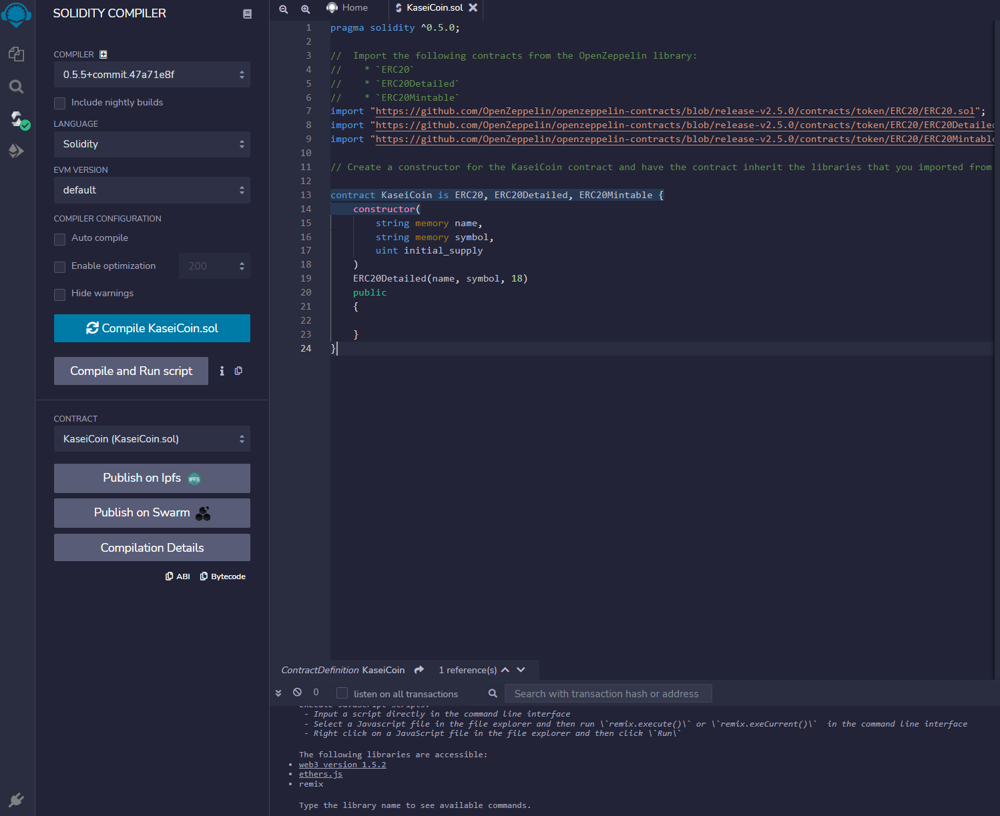
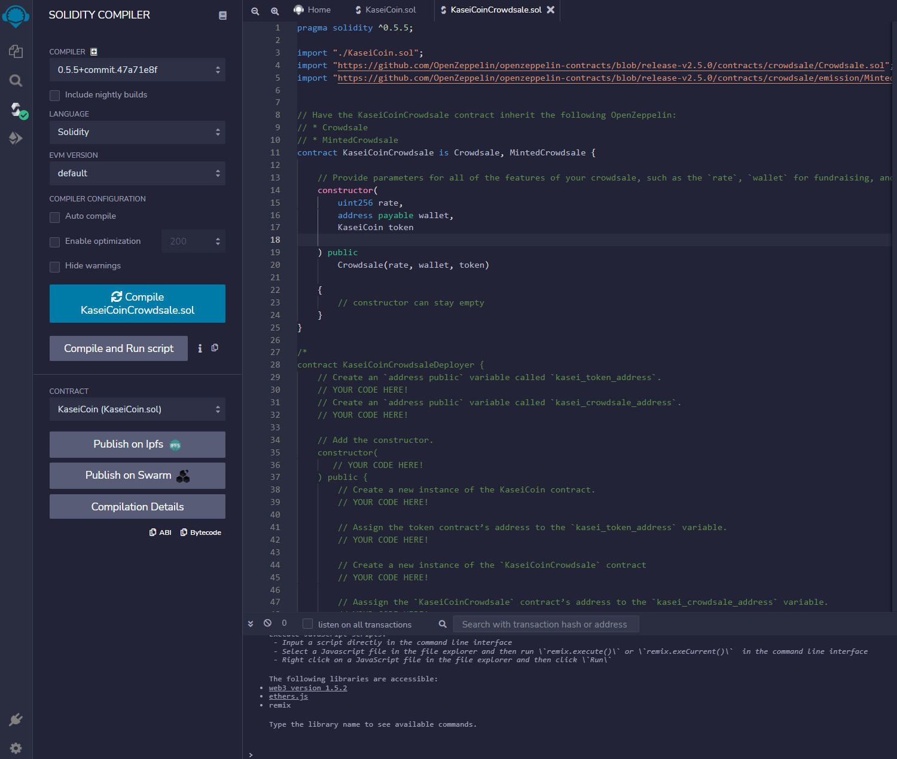
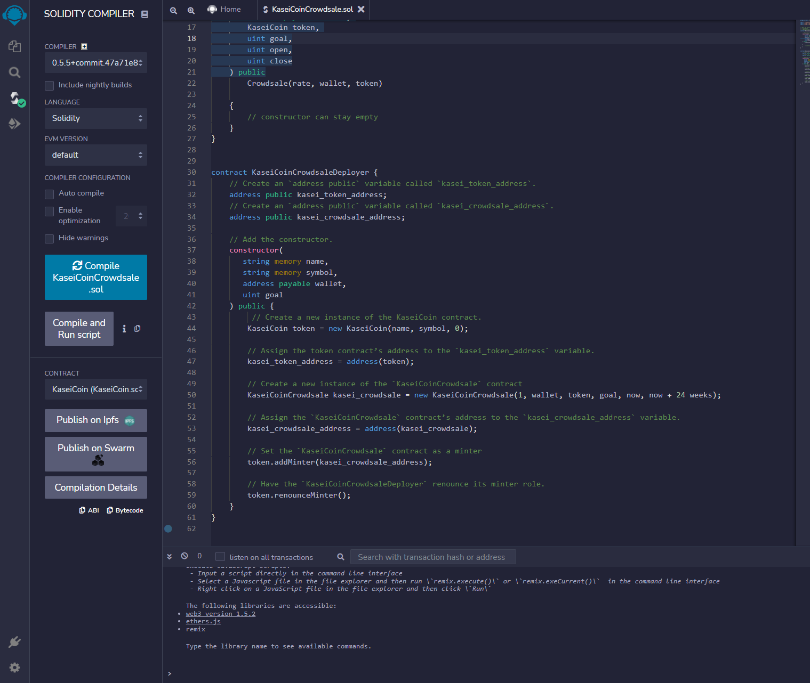
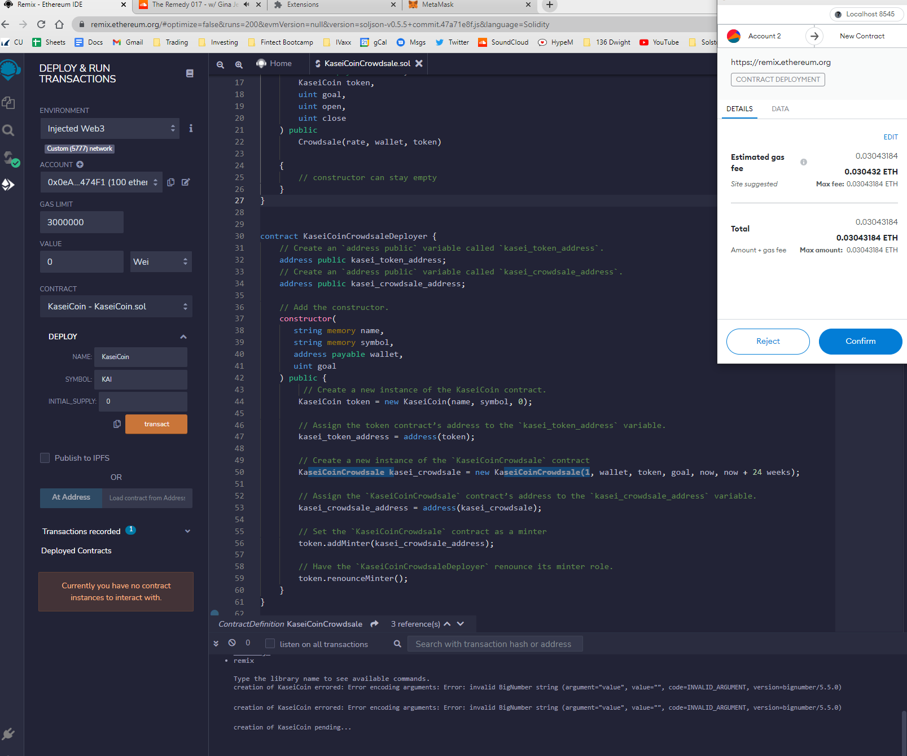
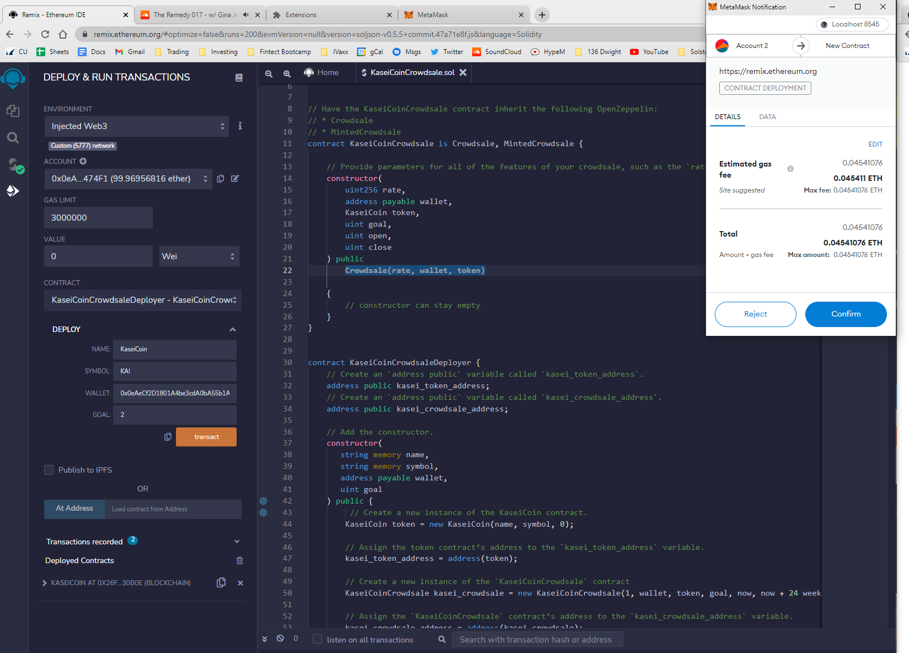
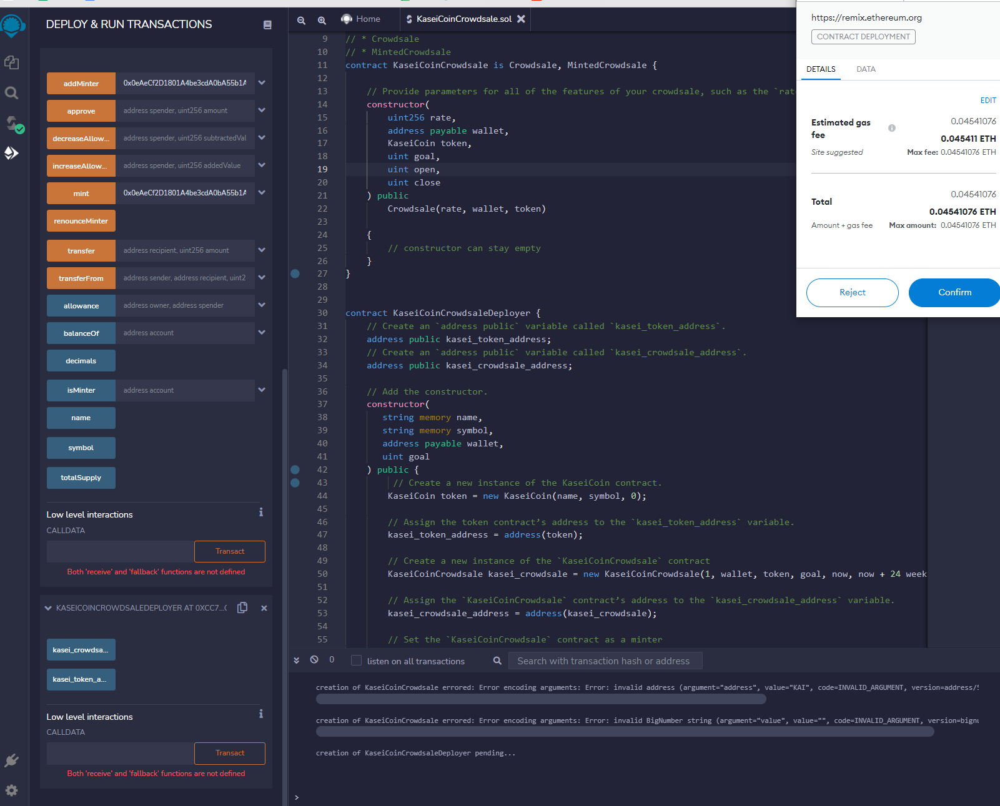
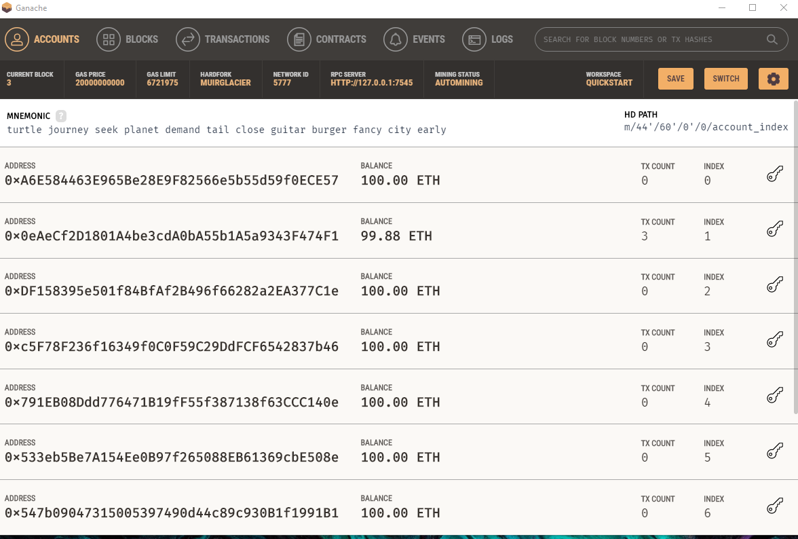

# Unit21: Martian Token Crowdsale

# Description

For this project, we are developing a monetary system for a new Mars colony by creating a KaseiCoin token contract, a KaseiCoin crowdsale contract and a KaseiCoin deployer contract. KaseiCoin will be a fungible token that’s ERC-20 compliant. We launched a crowdsale that will allow people who are moving to Mars to convert their earthling money to KaseiCoin.

# Instructions

The steps for this assignment are divided into the following subsections:

1. Create the KaseiCoin Token Contract

2. Create the KaseiCoin Crowdsale Contract

3. Create the KaseiCoin Deployer Contract

4. Deploy and Test the Crowdsale on a Local Blockchain

## KaseiCoin Contract Compiled

## KaseiCoin Crowdsale

## KaseiCoin Deployer Contract Compiled

## Transactions

## Transactions

## Transactions

## Transaction Proof

## Cheers!
